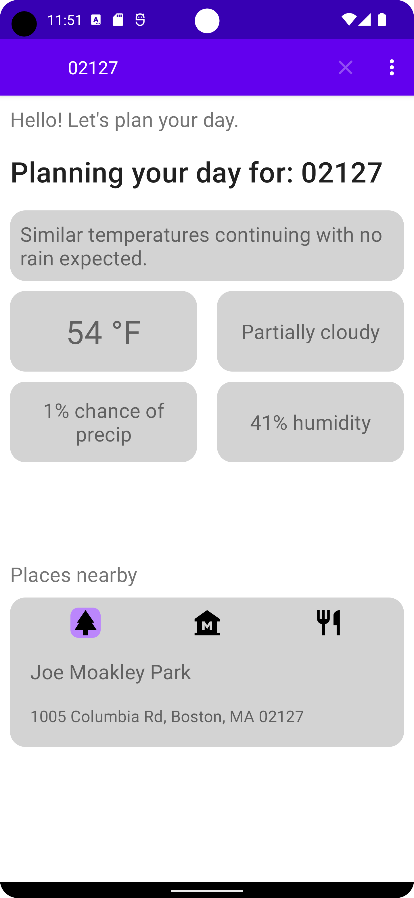

# WeatherWise

## An Android app to help plan your day.

This app was created for my honors project for CSE 3200 in the Spring 2023 semester. Users can enter a zipcode in the SearchView at the top of the screen. Once they press search, two API calls are made, one to Visual Crossing for weather info, and the next to the Google Places API for information on local businesses.

The purpose of the app is that users can use the weather info to determine what type of activity they want to do for the day, and then they can find local places to do the things they want, such as going out to eat at a restaurant or visiting a local park.

Please note: you will need both a valid Visual Crossing API key as well as a valid Google Places API key in order for this app to function correctly. Both of these APIs are free.

Furthermore: this is not the original GitHub repository, so the history is not identical to the original repo. This is due to the fact that the original repo had API keys in the commit history, so in order to avoid any security risks, the repository was completely restarted. Further improvements may be made in order to improve things such as the UI.

